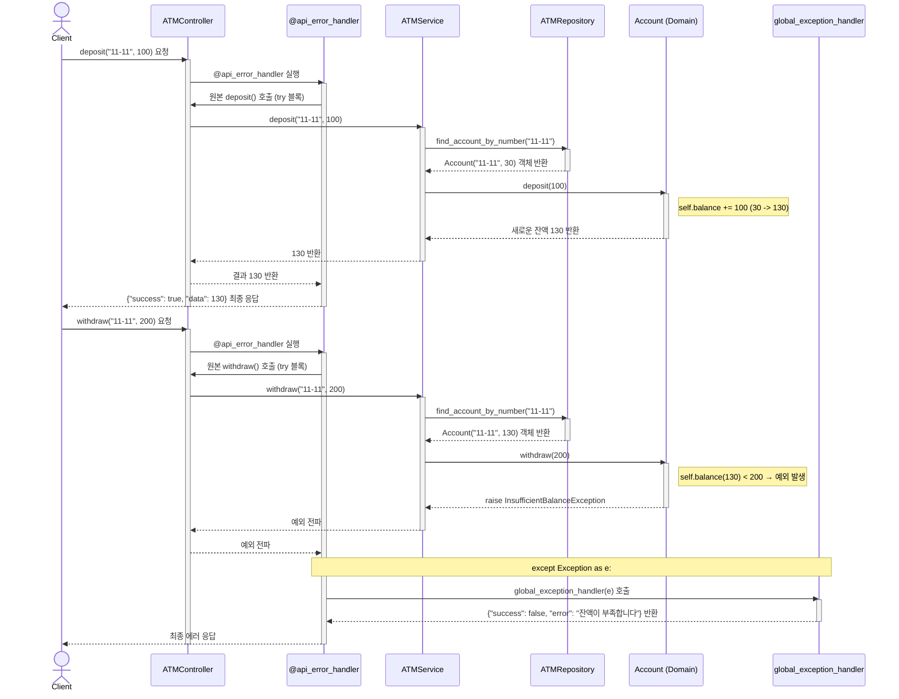

# 🐾BearATM

BearATM는 Python으로 구현된 Simple ATM(현금자동입출금기)입니다.<br>
카드 입력, PIN 인증, 계좌 선택, 입출금, 잔액조회 등 ATM의 핵심 기능을 Layered Architecture로 설계, 구현하였습니다.

## 주요 기능

- **카드 등록 및 검증**: 카드 번호로 등록 여부 확인, 등록되지 않은 카드 예외 처리
- **PIN 인증**: 카드 PIN 입력 및 검증 (틀릴 경우 예외 발생)
- **계좌 관리**: 카드에 여러 계좌 연결 및 계좌 선택
- **입금/출금**: 계좌에 대한 입금, 출금 기능 (잔액 부족, 비정상 금액에 대한 예외 처리)
- **잔액 조회**: 계좌별 잔액 확인
- **단위 테스트**: 각 기능에 대한 단위 테스트 구현
- **통합 테스트**: 카드 삽입 → PIN 인증 → 계좌 선택 → 입금/출금 등 실제 ATM 사용 시나리오 테스트 코드 포함

## 설치 및 실행 방법, 코드 구조

1. **Github clone**
    ```bash
    git clone https://github.com/shosae/ATM/
    ```
2. **가상환경 설정, 실행 및 pytest 설치**
    ```bash
    python -m venv .venv
    .venv\Scripts\activate
    pip install pytest pytest-cov
    ```
3. **테스트 실행**
    ```bash
    cd app
    python -m pytest --cov=. --cov-report=term-missing -v
    ```

4. **코드 구조**
    ```
    app/
      ├── controller/       # ATMController: 외부 API의 접점. 요청/응답 처리
      ├── service/          # ATMService: 핵심 비즈니스 로직 처리
      ├── repository/       # ATMRepository: 데이터 영속성 관리
      ├── domain/           # Card, Account: 도메인 비즈니스 규칙을 담은 객체
      ├── exceptions/       # 커스텀 예외 정의
      ├── tests/            # pytest 테스트 코드
      ├── error_handler.py     # API 예외 처리 데코레이터
      └── exception_handler.py # 예외별 에러 응답 생성

    ```
## 📝 시퀀스 다이어그램 (Sequence Diagram)
ATM의 핵심 동작인 입금(성공)과 출금(실패) 시나리오를 통해 전체 아키텍처의 상호작용 흐름을 보여줍니다.


## 🧪 테스트 결과 (Test & Coverage)

`pytest`와 `pytest-cov`를 사용하여 모든 기능에 대한 테스트 커버리지를 측정했으며, 전체 커버리지 96%를 달성했습니다.

```bash
(.venv) PS C:\Users\phone\Desktop\ATM\app> python -m pytest --cov=. --cov-report=term-missing -v
======================================================================================================================== test session starts ========================================================================================================================
platform win32 -- Python 3.10.0, pytest-8.4.1, pluggy-1.6.0 -- C:\Users\phone\Desktop\ATM\.venv\Scripts\python.exe
cachedir: .pytest_cache
rootdir: C:\Users\phone\Desktop\ATM\app
plugins: cov-6.2.1
collected 15 items                                                                                                                                                                                                                                                   

tests/test_depositwithdrawal.py::test_deposit PASSED                                                                                                                                                                                                           [  6%] 
tests/test_depositwithdrawal.py::test_withdraw PASSED                                                                                                                                                                                                          [ 13%] 
tests/test_depositwithdrawal.py::test_get_balance PASSED                                                                                                                                                                                                       [ 20%] 
tests/test_depositwithdrawal.py::test_deposit_invalid[0] PASSED                                                                                                                                                                                                [ 26%] 
tests/test_depositwithdrawal.py::test_deposit_invalid[-1] PASSED                                                                                                                                                                                               [ 33%] 
tests/test_depositwithdrawal.py::test_withdraw_invalid[0] PASSED                                                                                                                                                                                               [ 40%] 
tests/test_depositwithdrawal.py::test_withdraw_invalid[-1] PASSED                                                                                                                                                                                              [ 46%] 
tests/test_depositwithdrawal.py::test_withdraw_insufficient PASSED                                                                                                                                                                                             [ 53%] 
tests/test_domain.py::test_card_is_registered PASSED                                                                                                                                                                                                           [ 60%] 
tests/test_domain.py::test_card_is_unregistered PASSED                                                                                                                                                                                                         [ 66%]
tests/test_domain.py::test_verify_pin_with_correct_pin PASSED                                                                                                                                                                                                  [ 73%] 
tests/test_domain.py::test_verify_pin_with_incorrect_pin PASSED                                                                                                                                                                                                [ 80%]
tests/test_domain.py::test_get_accounts_by_registered_card_number PASSED                                                                                                                                                                                       [ 86%] 
tests/test_integration.py::test_user_flow_insert_card_verify_pin_select_account_deposit_single_account PASSED                                                                                                                                                  [ 93%] 
tests/test_integration.py::test_user_flow_insert_card_verify_pin_select_account_withdraw_deposit_multi_account PASSED                                                                                                                                          [100%] 

========================================================================================================================== tests coverage =========================================================================================================================== 
__________________________________________________________________________________________________________ coverage: platform win32, python 3.10.0-final-0 __________________________________________________________________________________________________________ 

Name                                Stmts   Miss  Cover   Missing
-----------------------------------------------------------------
controller\atm_controller.py           25      0   100%
domain\account.py                      23      3    87%   8-10
domain\card.py                         12      0   100%
error_handler.py                       14      0   100%
exception_handler.py                   12      1    92%   17
exceptions\exceptions.py               10      0   100%
repository\atm_repository.py           21      1    95%   29
repository\atm_repository_base.py      11      2    82%   10, 15
service\atm_service.py                 29      1    97%   30
service\atm_service_base.py            17      5    71%   6, 10, 14, 18, 22
tests\test_depositwithdrawal.py        42      0   100%
tests\test_domain.py                   33      0   100%
tests\test_integration.py              46      0   100%
-----------------------------------------------------------------
TOTAL                                 295     13    96%
======================================================================================================================== 15 passed in 0.30s ========================================================================================================================= 
```
